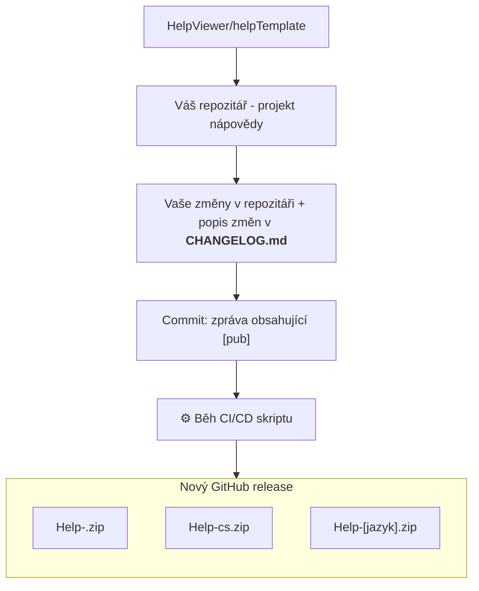

# &#128214; Vytvoření nové nápovědy

1. Přejděte k repozitáři: **[helpTemplate][template]**
2. Klikněte napravo nahoře na **Use this template** a **Create a new repository**.
3. Nastavte organizaci a pojmenujte svůj repozitář podle potřeby
4. Součástí šablony je **[CI skript][template-CI]**, který nepotřebujete upravovat. V budoucnu však mohou přibýt funkcionality kvůli kterým by toto mohlo být potřeba. V takovém případě CI skript přepište ručně kopií z **helpTemplate**.
5. Repozitář naklonujte do svého místního prostředí:
  ```
  git clone https://github.com/{UZIVATEL nebo ORGANIZACE}/{NAZEV-REPOZITARE}.git
  ```
6. Soubory: **LICENSE** a **README.md** upravte podle své potřeby

## Schéma procesu



[template]: https://github.com/HelpViewer/helpTemplate "Šablona nápovědy"
[template-CI]: https://github.com/HelpViewer/helpTemplate/blob/main/.github/workflows/publish.yml "CI skript"