# 📖 Vytvoření nové nápovědy

1. Přejděte k repozitáři: **[helpTemplate][template]**
2. Klikněte napravo nahoře na **Use this template** a **Create a new repository**.
3. Nastavte organizaci a pojmenujte svůj repozitář podle potřeby
4. Součástí šablony je **[CI skript][template-CI]**, který nepotřebujete upravovat. V budoucnu však mohou přibýt funkcionality kvůli kterým by toto mohlo být potřeba. V takovém případě CI skript přepište ručně kopií z **helpTemplate**.
5. Repozitář naklonujte do svého místního prostředí:
  ```
  git clone https://github.com/{UZIVATEL nebo ORGANIZACE}/{NAZEV-REPOZITARE}.git
  ```
6. Soubory: **LICENSE** a **README.md** upravte podle své potřeby

## Schéma procesu

```mermaid
graph TD; 
  subgraph outs["Nový GitHub release"]
  direction TB
  H1["Help-.zip"]
  H2["Help-cs.zip"]
  H3["Help-[jazyk].zip"]
  end
  T["HelpViewer/helpTemplate"] --> YP["Váš repozitář - projekt nápovědy"]
  YP --> YPC["Vaše změny v repozitáři + popis změn v <b>CHANGELOG.md</b>"]
  YPC --> CO["Commit: zpráva obsahující [pub]"]
  CO --> CI["⚙️ Běh CI/CD skriptu"]
  CI -->|\+ 🔑 PAT Token| outs
```



[template]: https://github.com/HelpViewer/helpTemplate "Šablona nápovědy"
[template-CI]: https://github.com/HelpViewer/helpTemplate/blob/main/.github/workflows/publish.yml "CI skript"